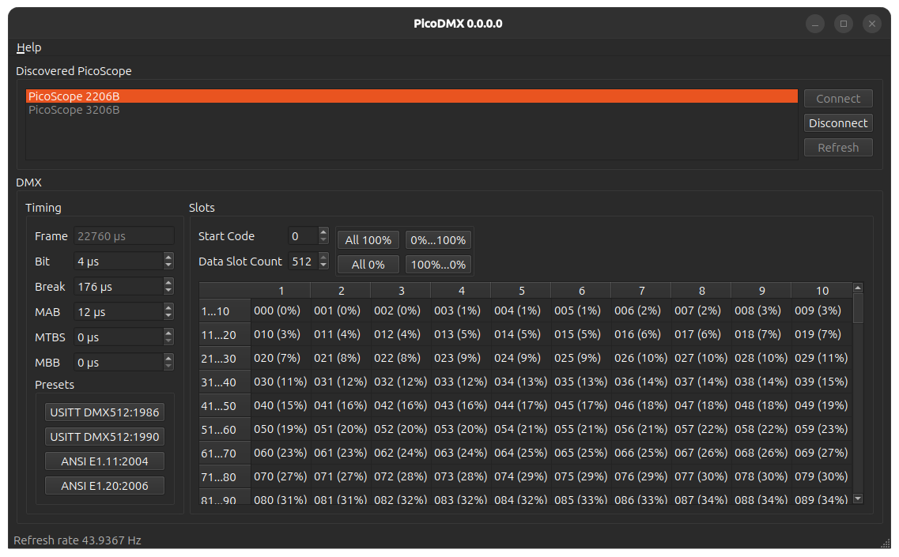

# PicoDMX

PicoDMX is a way to send DMX512 frames, with precise and variable timing, for the purposes of testing, using a PicoScope with an arbitrary waveform generator (AWG).

**It is not designed for show control!**

## Why?

DMX has had a number of revisions over the year with regards minimum and recommended timing.\
Timings such as the Break, and Mark-After-Break; are the most notable changes.\
DMX also has a very wide range of allowable timings.\
As-such you often find incompatibility between devices, and the "go-to" solution is to alter the DMX transmitter timings.\
Generally DMX transmitters only offer a small number of preset timings (sometimes referred to as speeds). For example a large, well know, American electronic based controls manufacturer offers 4 speeds: `Maximum`, `Fast`, `Medium`, `Slow`.\
These preset speeds are perfectly fine for everyday use, and will quite often solve day-to-day compatibility issues. However for testing, a way of controlling each and every timing of a DMX frame is advantageous.



## Requirements

PicoDMX has been successfully used with both Windows and Linux.\
It is expected to work either directly, or with minimal change, with MacOS.

### Software

* C++ Compiler
* [CMake](cmake.org)
* [Qt6](qt.io)
* [PicoSDK](www.picotech.com)

### Hardware

* PicoScope 2000/3000/4000 with AWG
* DMX Line Driver

#### PicoScope

Not every PicoScope includes an arbitrary waveform generator (AWG).\
Not every PicoScope with an AWG has the same buffer size.

Please consult the datasheet for you PicoScope for details.

##### Buffer size

Pico Tech offer a wide range of PicoScope that allow you to pick the model for your requirements and budget.\
One of the variable items is the AWG buffer size.\
PicoDMX requires, for a full 512 data slots using ANSI E1.20:2006 preset timing, a buffer size of at least 22,760 samples.\
The 2000B series offers 32 kS, which is more than large enough. While the 2405A only offers 8 kS which is too small.

PicoScope with smaller buffers can still be used, but compromises to the frame must be made. e.g. Reducing the data slot count.\
Using ANSI E1.20:2006 preset timing, 175 data slots can fit in a buffer size of 7976 samples.

#### DMX Line Driver

DMX is a multi-drop RS485 network, witch uses a balanced pair.\
The output from the PicoScope AWG is a single 4 V<sub>pkpk</sub>.\
PicoDMX uses only the positive half of the waveform, which results in a 0-2 V<sub>dc</sub> digital signal.\
This signal needs to then be converted into an RS485 compatible balanced signal.\
Typically a DMX cable is connected using a IEC 61076-2-103 connector, more commonly known as an XLR.

The very simplest way todo this, is with a single RS485 line driver (e.g. SN75LBC184), a 5 V<sub>dc</sub> supply, and a 5 pin XLR.

```
       +5v               +5v
        ▲                 ▲    ╔══╗
        │   ╔═══\/═══╗    │    ║5 ║
        │  ─║R*   VCC║────┘    ║4 ║
        ├───║!RE    B║─────────║2 ║
╔════╗  └───║DE     A║─────────║3 ║
║AWG+║──────║D    GND║────┬────║1 ║
║AWG─║───┐  ╚════════╝    │    ╚══╝
╚════╝   ▼  SN75LBC184    ▼    XLR5
        GND              GND

```

##### Improvement 1

RS485 requires that the source (and end) are terminated to match the cable impedance, nominally for DMX this is 120 Ω.\
So the first improvement we can make is to add a 120 Ω resistor.

```
                             ┌──┬──┐
       +5v               +5v │ ╔═╗ │
        ▲                 ▲  │ ║1║ │ ╔══╗
        │   ╔═══\/═══╗    │  │ ║2║ │ ║5 ║
        │  ─║R*   VCC║────┘  │ ║0║ │ ║4 ║
        ├───║!RE    B║───────┘ ╚═╝ └─║2 ║
╔════╗  └───║DE     A║──────────┴────║3 ║
║AWG+║──────║D    GND║────┬──────────║1 ║
║AWG─║───┐  ╚════════╝    │          ╚══╝
╚════╝   ▼  SN75LBC184    ▼          XLR5
        GND              GND

```

##### Improvement 2

The PicoScope _can_ generate negative voltages, and while PicoDMX does not use these, we should protect against them.\
A small schottky diode (e.g. BAT43) can be added in reverse bias across AWG+ and AWG-, protecting the line driver.


```
         ┌───────[D SN75LBC184]
╔════╗   │ BAT43
║AWG+║───┴──│◄──┐
║AWG─║───┐      ▼
╚════╝   ▼     GND
        GND
```

##### Improvement 3

The major we have ignored is the peak voltage of the AWG being 2 V<sub>dc</sub>.
5v and 3v3 TTL logic 1 input threshold (V<sub>IH</sub>) is 2 V<sub>dc</sub>. So while this setup works most of the time, it only just works.\
Ideally we would want to trigger a logic 1 at a lower voltage, this not only guarantees that a logic 1 is triggered but also reduces the trigger delay due to rise time.\
We should therefore treat the AWG signal as being 2v5 TTL (V<sub>IH</sub> = 1.7 V<sub>dc</sub>), or 1v8 CMOS (V<sub>IH</sub> = 1.17 V<sub>dc</sub>).

A logic level shifter (e.g. SN74LVLT34) can be used to achieve this.\
The downside being for the SN74LVLT34 to translate from 2v5 TTL/1v8 CMOS to 3v3 TTL (5v TTL compatible output), is that it requires a 3.3 V<sub>dc</sub> supply.

The SN75LBC184 could be replaced with a 3v3 line driver (e.g. MAX3483CPA) or an additional voltage rail could be supplied.


```
            SN74LVLT34
         ┌───────►──────[D MAX3483CPA]
╔════╗   │ BAT43
║AWG+║───┴──►│──┐
║AWG─║───┐      ▼
╚════╝   ▼     GND
        GND
```
